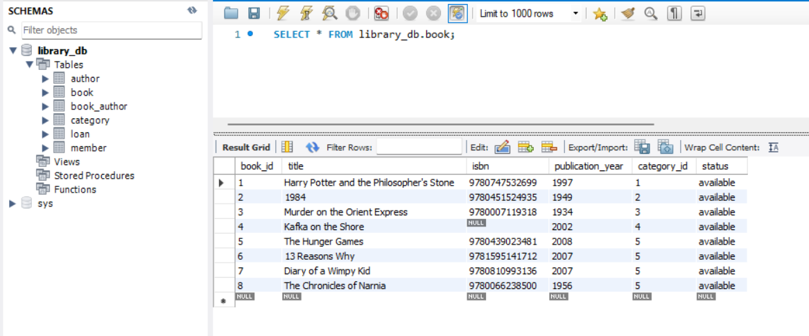
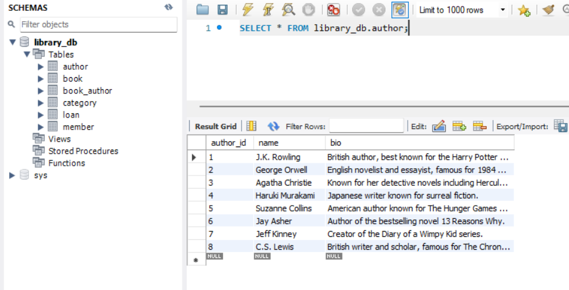
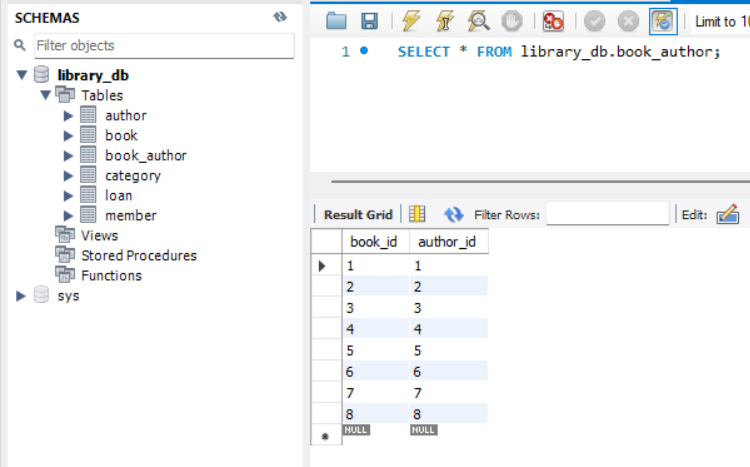
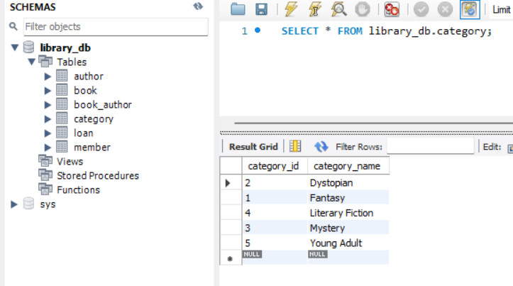
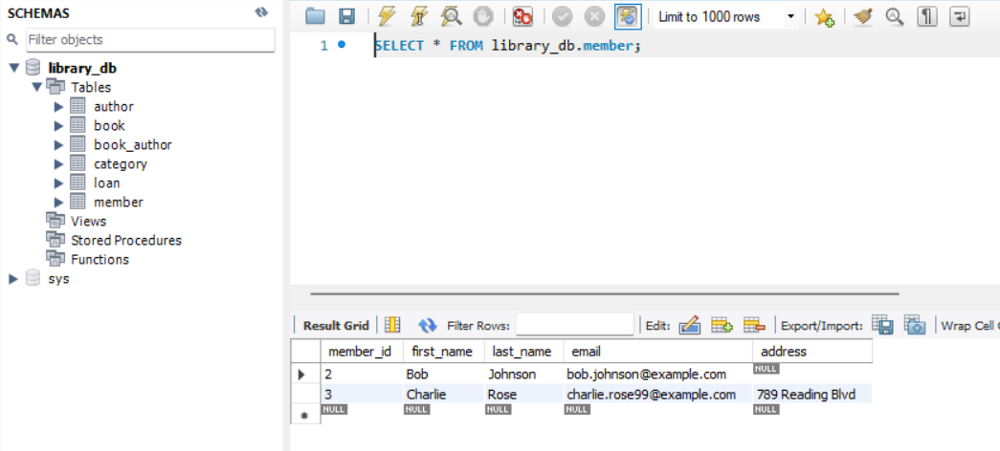
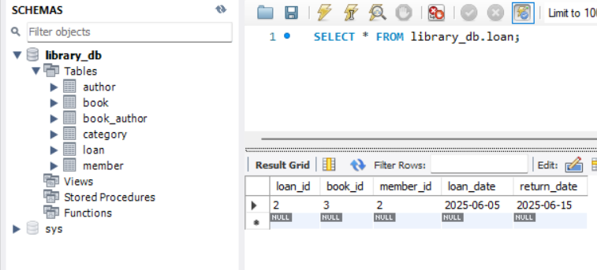

# 📄 Task 2 – Data Insertion and Handling Nulls

##  Objective

This SQL script is part of the **SQL Developer Internship Task 2**, focused on:

- Inserting sample data into a library database  
- Handling null/default values  
- Updating existing records  
- Deleting specific data entries  

---

##  Tools Used

- **MySQL** (MySQL Workbench)

### Predefined Tables (created in Task1):
- `author`
- `category`
- `book`
- `book_author` *(many-to-many)*
- `member`
- `loan`

---

##  Script Contents

### 1. Author Insertions
Adds 8 authors including:

- J.K. Rowling  
- George Orwell  
- Agatha Christie *(bio initially NULL, later updated)*  
- Haruki Murakami  
- Suzanne Collins  
- Jay Asher  
- Jeff Kinney  
- C.S. Lewis  

---

### 2. Category Insertions
Adds the following categories:

- Fantasy  
- Dystopian  
- Mystery  
- Literary Fiction  
- Young Adult *(inserted conditionally if not present)*  

---

### 3. Book Insertions
Adds 8 books with valid `ISBN`, `publication_year`, and `category_id`. Some values use:

- `NULL` (e.g., missing ISBN)  
- `DEFAULT` (e.g., status)

---

### 4. Book–Author Relationships
Populates the `book_author` join table with correct relationships using accurate `book_id` and `author_id`.

---

### 5. Member Insertions
Adds 3 members. One has a `NULL` address field.

---

### 6. Loan Insertions
Records two book loans:

- One **ongoing** (`return_date = NULL`)  
- One **completed**

---

### 7. Updates
- Adds missing bio for Agatha Christie  
- Corrects email for Charlie Rose

---

### 8. Deletes
- Removes a mistakenly added member: `alice@example.com`

---

## 🔍 Notes

- **MySQL Workbench** users: Disable **safe update mode** when running `UPDATE` or `DELETE` queries.
- **SQLite users**: Adjust `AUTO_INCREMENT` and `ENUM` types as needed.

---

##  How to Use

1. Ensure your schema is already created using the provided `CREATE TABLE` statements (Given in Task1).
2. Run the script `task2_data_insertion_handling.sql` in your SQL client.
3. Verify inserted data with:

```sql
SELECT * FROM book;
SELECT * FROM author;
SELECT * FROM loan;

## 📸 Table Outputs (Screenshots)

Below are the outputs of `SELECT *` queries run against each table in the database. These screenshots provide a visual confirmation of inserted, updated, and deleted data.

 These screenshots reflect the current state of the database after executing all `INSERT`, `UPDATE`, and `DELETE` operations from the script.

### Book Table


### Author Table


### Book–Author Table (Join Table)


### Category Table


### Member Table


### Loan Table

